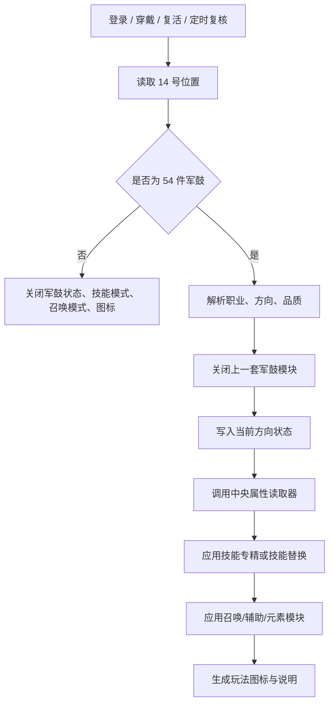

# 军鼓位持续流派 BUFF 丰富玩法实施计划

> **For agentic workers:** REQUIRED SUB-SKILL: Use superpowers:executing-plans to implement this plan task-by-task. Steps use checkbox (`- [ ]`) syntax for tracking.

**Goal:** 把 14 号军鼓位的 54 件装备从“单纯加属性”升级为可持续、可读、可管理、可扩展的九流派玩法系统，并同步补齐玩家看到的道具说明。

**Architecture:** 采用“装备名映射 -> 流派状态 -> 中央读取器 -> 技能/召唤/被动模块”的持续生效架构。穿戴、登录、复活、装备持久耗尽、脚本回收和强制取下都只改变军鼓状态，最终属性由统一读取入口重新计算；技能替换、召唤替换和互斥形态全部由独立模块管理，避免把所有逻辑堆在一个定时器里。

**Tech Stack:** Mir200 / 翎风脚本、`QuestDiary`、`QFunction-0.txt`、`QManage.txt`、`ItemDescList.txt`、GBK/ANSI 文本、PowerShell 静态检查。

---

## 1. 设计目标

### 1.1 玩家体验目标

军鼓不是一件“穿上以后多几十点攻击”的普通装备，而是一个职业玩法开关。玩家看到军鼓名称后，应该能马上知道：

- 这是哪个职业的哪种玩法；
- 这个玩法会强化哪些技能或召唤；
- 它会牺牲什么；
- 什么时候达到完整形态；
- 它和其他玩法是否冲突。

### 1.2 工程目标

- 54 件道具继续保持 `9 个方向 × 6 个品质` 的规则；
- 方向名称、品质名称、运行状态、说明文字使用同一套数据；
- 后续增加第 10 个方向时，不需要复制整套登录、穿戴、清理、回收逻辑；
- 每个玩法模块都有明确的开关、读取入口、关闭入口和静态检查项；
- 不把 `ItemDescList.txt` 当作运行时逻辑来源；
- 任何装备消失路径都能让军鼓状态被重新读取并关闭。

### 1.3 本期边界

本期采用用户确认的 B 方案：

- 以穿戴后持续生效为主；
- 登录、换装、复活、持久耗尽、脚本取下后重新计算；
- 不把核心玩法绑定在高频攻击触发上；
- 可以保留少量被动计数或技能替换，但必须由持续状态控制；
- 不新增不可验证的引擎命令；遇到当前版本没有的能力，先做能力探测，再采用降级实现。

---

## 2. 总体数据模型

### 2.1 军鼓状态

运行时只维护一组统一状态：

```text
N$军鼓有效       0/1
S$军鼓名称       当前 14 号位置的数据库物品名
S$军鼓方向       拆门板/铁头娃/剁馅机/电耗子/火葫芦/小冰箱/养娃人/奶不死/毒嘴子
N$军鼓品质       1..6
N$军鼓阶段       当前品质已经解锁到的玩法阶段
N$军鼓技能模式   当前技能替换或专精模式
N$军鼓召唤模式   当前召唤形态
N$军鼓冲突状态   互斥模块是否已经关闭
```

### 2.2 配置字段

后续实现建议把 54 件映射整理成单独的规格表或脚本数据块，每行至少包含：

| 字段 | 示例 | 用途 |
| --- | --- | --- |
| `Name` | `封顶·养娃人` | 精确匹配数据库物品名 |
| `Direction` | `养娃人` | 选择流派模块 |
| `Job` | `taoist` | 限制适用职业 |
| `Quality` | `6` | 决定解锁阶段 |
| `BaseReader` | `BB,攻魔道` | 调用中央读取器 |
| `SkillModule` | `召唤神兽专精` | 技能等级或技能替换 |
| `PassiveModule` | `宝宝成长` | 持续被动模块 |
| `CostModule` | `人物转宝宝` | 明确代价 |
| `ConflictGroup` | `TAO_SUMMON` | 关闭互斥形态 |
| `DescKey` | `军鼓_养娃人` | 生成道具说明 |

### 2.3 运行流程



---

## 3. 九大流派玩法设计

下面的设计把每个方向拆成四层：

1. **基础形态**：粗坯就能感受到方向；
2. **专精模块**：精制、淬火后逐步强化相关技能或召唤；
3. **流派被动**：成名后开启有代价的玩法机制；
4. **完整形态**：压轴、封顶解锁最终构筑，不再只是继续堆数值。

### 3.1 战士：拆门板

**定位：爆发破防，打一轮就要见血。**

| 品质阶段 | 玩法 |
| --- | --- |
| 粗坯 | 调用攻魔道/元素读取，强化战士爆发属性；只强化烈火、开天、逐日中的基础伤害模块 |
| 精制 | 开启“破门”状态：烈火、开天、逐日类技能获得独立技能加成；普通攻击不获得同等收益 |
| 淬火 | 开启“先手重击”：当人物当前没有其他军鼓攻击模式时，第一套爆发技能优先使用破防模块 |
| 成名 | 开启“打空护甲”：牺牲部分吸血或续航，把一部分爆发收益转成目标防御压制；目标侧只保留短时标记 |
| 压轴 | 开启“破门连锁”：爆发技能命中后，下一次烈火或开天获得一次额外技能倍率；使用后清除连锁标记 |
| 封顶 | 开启“拆门板完整形态”：技能爆发、目标防御压制、连锁一次性生效；与剁馅机的连续频率模块互斥 |

**可实现方式：**

- 使用现有技能等级、技能威力、元素和攻魔道读取器；
- 使用 `ChangeDamageValue` 或当前版本已有的技能触发变量承载一次性连锁；
- 目标防御压制优先使用样本2的目标侧标记 + `M.` 读取模式；
- 如果当前版本没有稳定的技能替换能力，降级为指定技能专属伤害和目标压制，不伪造技能替换。

### 3.2 战士：铁头娃

**定位：站得住，挨打有收益。**

| 品质阶段 | 玩法 |
| --- | --- |
| 粗坯 | HP、物防、魔防和受击减伤读取 |
| 精制 | 开启“硬吃”：受到高额单次伤害时，把一部分伤害转为短时护盾记录 |
| 淬火 | 开启“越挨越硬”：短时间内连续受击时，叠加最多 3 层抗性标记；脱战或状态刷新时重置 |
| 成名 | 开启“反震”：护盾存在时，部分受击伤害转为反震或下一次攻击加成 |
| 压轴 | 开启“半血不退”：低血状态下获得一次短时减伤和控制抗性，不直接制造无敌 |
| 封顶 | 开启“铁头娃完整形态”：护盾、受击叠层、低血保命和反震同时存在；与拆门板的爆发模块互斥 |

**可实现方式：**

- 持续属性使用中央 HP/MP、防御和元素读取；
- 受击记录使用角色私有数字变量；
- 减伤使用掉血前触发修改当前伤害；
- 低血判断必须增加一次性冷却和清理标签，避免每次掉血重复开保命。

### 3.3 战士：剁馅机

**定位：频率和命中，靠连续出手压垮对手。**

| 品质阶段 | 玩法 |
| --- | --- |
| 粗坯 | 命中、攻击速度和普通攻击稳定性 |
| 精制 | 半月、刺杀、攻杀类技能获得频率向专精 |
| 淬火 | 开启“连着砍”：连续命中同一目标时记录连击层数，换目标或超过短时窗口后清零 |
| 成名 | 连击层数提高命中或技能威力，但不直接无限叠攻击速度 |
| 压轴 | 连击达到阈值后，下一次范围技能获得一次额外范围或伤害加成 |
| 封顶 | 开启“剁馅机完整形态”：命中、连击、范围收尾形成循环；与拆门板的爆发连锁互斥 |

**可实现方式：**

- 继续使用中央五维、攻速和技能威力读取；
- 连击状态用目标名、时间戳或短时数字变量记录；
- 不在 2 秒刷新里反复叠加 `ChangeSpeed`；
- 若当前版本没有目标唯一标识，降级为人物连续攻击窗口，不做跨目标连击。

### 3.4 法师：电耗子

**定位：雷系专精，命中后扰乱对手。**

| 品质阶段 | 玩法 |
| --- | --- |
| 粗坯 | 雷元素、魔法命中和魔法暴击方向 |
| 精制 | 雷电术、群雷类技能获得技能威力专精 |
| 淬火 | 开启“麻一下”：雷系技能有概率附加短时施法/魔法命中压制 |
| 成名 | 开启“连锁电”：同一目标再次被雷系技能命中时，刷新雷痕并增强下一次雷伤 |
| 压轴 | 雷痕达到阈值时，触发一次短时魔御压制；必须有目标侧标记和清理入口 |
| 封顶 | 开启“电耗子完整形态”：雷系技能、雷痕、命中压制、一次魔御压制形成循环；与火葫芦的灼烧模块互斥 |

**可实现方式：**

- 雷系技能优先通过现有技能名和攻击触发分支识别；
- 雷痕使用目标侧 `M.` 状态、图标和关闭标签；
- 触发概率使用当前版本已有随机条件；
- 若雷系技能名不完整，先建立本服技能白名单，不用模糊包含。

### 3.5 法师：火葫芦

**定位：范围灼烧，持续压血，清怪效率高。**

| 品质阶段 | 玩法 |
| --- | --- |
| 粗坯 | 火元素、火系技能伤害和怪物伤害方向 |
| 精制 | 火墙、流星火雨、大火球获得技能专精 |
| 淬火 | 开启“挂火”：火系技能命中后附加短时灼烧标记 |
| 成名 | 灼烧目标再次受到火系技能时，提前结算一段额外伤害并刷新灼烧 |
| 压轴 | 灼烧结束或被重复点燃时产生一次小范围余火效果 |
| 封顶 | 开启“火葫芦完整形态”：火系技能、灼烧、余火、范围清怪形成循环；与电耗子的雷痕互斥 |

**可实现方式：**

- 灼烧可以先用目标侧标记 + 定时结算实现；
- 范围余火优先复用已有 `RangeHarm` 或当前版本同类范围伤害命令；
- 如果当前版本没有可靠的目标侧延迟伤害，降级为火系技能二次伤害，不留下无法清理的状态。

### 3.6 法师：小冰箱

**定位：冰系防守，控制与魔法盾共存。**

| 品质阶段 | 玩法 |
| --- | --- |
| 粗坯 | MP、魔御、冰元素和控制抗性 |
| 精制 | 冰系技能获得技能等级或威力专精 |
| 淬火 | 魔法盾开启时获得冰甲状态；冰甲只允许一层 |
| 成名 | 冰甲被打破时，获得短时魔伤减免或控制抗性 |
| 压轴 | 冰系技能命中后，有机会给目标附加短时减速/命中压制 |
| 封顶 | 开启“小冰箱完整形态”：冰甲、破盾保护、冰系控制和续航完整联动；与火葫芦的灼烧模块互斥 |

**可实现方式：**

- 魔法盾状态读取必须以当前版本技能/状态标识为准；
- 冰甲状态要有最大层数、刷新时间和关闭标签；
- 不直接强制删除玩家原有魔法盾，军鼓只修改附加层；
- 目标控制如果没有稳定的 `M.ChangeState` 支持，则退化为命中/施法压制。

### 3.7 道士：养娃人

**定位：召唤物是主角，人物负责供养和指挥。**

| 品质阶段 | 玩法 |
| --- | --- |
| 粗坯 | 宝宝攻击、生命、道术和召唤相关读取 |
| 精制 | 召唤神兽、骷髅或本服已有召唤技能获得技能等级专精 |
| 淬火 | 开启“宝宝成长”：人物部分道术或生命按比例转给宝宝；只在宝宝读取器中计算 |
| 成名 | 开启“护主”：宝宝存在时，人物获得少量减伤或异常抗性；宝宝消失后立即重算 |
| 压轴 | 开启召唤形态替换：使用本服已经存在的特殊召唤技能时保留快捷键 |
| 封顶 | 开启“养娃人完整形态”：召唤替换、宝宝成长、护主、宝宝专属技能强化全部生效；与毒嘴子的直伤模块互斥部分只限制附加模块，不禁用基础道术 |

**可实现方式：**

- 优先复用样本2的 `@_@BB读取`、`GetSkillKey`、`DELSKILL`、`SetSkillKey` 模式；
- 替换召唤技能前必须保存快捷键；
- 关闭军鼓、转职、死亡、脚本回收宝宝时都要清理召唤模式；
- 如果本服没有对应特殊召唤技能，保留原召唤技能，只启用宝宝属性成长。

### 3.8 道士：奶不死

**定位：治疗、护盾、团队辅助，牺牲部分直伤。**

| 品质阶段 | 玩法 |
| --- | --- |
| 粗坯 | HP/MP、回复、物防/魔防和辅助技能方向 |
| 精制 | 群体治疗术、幽灵盾、神圣战甲类技能获得技能等级或效果强化 |
| 淬火 | 开启“续上”：治疗技能使用后，目标获得短时恢复标记 |
| 成名 | 开启“护住”：辅助技能同时给队友或自己附加一次短时受击减伤 |
| 压轴 | 开启“救急”：低血队友被治疗时额外获得一次控制抗性或魔伤减免 |
| 封顶 | 开启“奶不死完整形态”：治疗、护盾、低血救急和团队辅助完整联动；直伤收益低于毒嘴子和养娃人 |

**可实现方式：**

- 读取中心优先使用 HP/MP、防御、元素、技能等级；
- 治疗后的目标状态若能使用目标前缀则使用 `M.` 状态；
- 团队范围过大时先按施法目标或自己实现，避免遍历全地图；
- 所有辅助状态要有独立关闭标签，不能只关闭图标不重算属性。

### 3.9 道士：毒嘴子

**定位：毒咒压制，持续削弱敌人。**

| 品质阶段 | 玩法 |
| --- | --- |
| 粗坯 | 道术、毒恢复、毒躲避、毒系技能方向 |
| 精制 | 施毒术、诅咒术、灵魂火符类技能获得专精 |
| 淬火 | 开启“挂毒”：毒系技能命中后附加目标毒印 |
| 成名 | 毒印目标受到道术伤害时，追加一次短时防御/魔御削弱 |
| 压轴 | 毒印达到阈值后触发一次“毒爆”，清除毒印并造成一次额外伤害 |
| 封顶 | 开启“毒嘴子完整形态”：挂毒、毒印、压制、毒爆形成循环；与奶不死的团队辅助模块互斥高阶部分 |

**可实现方式：**

- 使用目标侧 `M.` 标记、`M.SetArrBuff`、目标重算和 `CloseArrBuff`；
- 毒印必须设最大层数和刷新时间，防止无限叠层；
- 毒爆触发后必须同时清掉层数和图标；
- 若当前版本没有可靠的目标侧毒伤结算，则退化为毒系技能伤害加成和目标防御压制。

---

## 4. 六档品质解锁规则

品质不只提高数字，还决定可用模块：

| 品质 | 玩法解锁 | 管理规则 |
| --- | --- | --- |
| 粗坯 | 基础流派 + 1 个中央读取模块 | 不开启复杂状态 |
| 精制 | 第二属性模块 + 指定技能专精 | 不允许技能替换 |
| 淬火 | 流派核心状态，如雷痕、灼烧、冰甲、毒印、连击 | 状态最多 1 个主标记 |
| 成名 | 流派被动或团队联动 | 允许目标侧短时标记 |
| 压轴 | 高级形态，如连锁、护盾破裂、召唤替换、毒爆 | 需要独立关闭标签 |
| 封顶 | 完整流派循环 + 终极副作用/代价 | 必须明确互斥组和降级路径 |

统一代价设计：

- 爆发流牺牲续航；
- 肉盾流牺牲部分爆发；
- 频率流不叠加无限攻速，而是通过连击和命中收益体现；
- 元素流之间设置高阶互斥，避免一件军鼓同时拿到雷、火、冰三套完整循环；
- 召唤流把人物收益转给宝宝，不重复计算人物和宝宝两份完整收益；
- 辅助流的团队收益优先受目标数量和持续时间限制。

---

## 5. 互斥、切换和清理

### 5.1 互斥组

| 互斥组 | 模块 |
| --- | --- |
| `WARRIOR_FORM` | 拆门板、铁头娃、剁馅机的高阶循环 |
| `MAGE_ELEMENT` | 电耗子、火葫芦、小冰箱的高阶元素循环 |
| `TAOIST_ROLE` | 养娃人、奶不死、毒嘴子的高阶角色循环 |
| `SKILL_REPLACE` | 同一时间只允许一个军鼓技能替换 |
| `TARGET_MARK` | 同一目标的军鼓主标记按方向互斥或刷新，不允许无限并存 |

### 5.2 必须覆盖的关闭入口

- `@TakeOnEx`：先关闭上一件军鼓，再应用新军鼓；
- `@TakeOffEx`：清除所有军鼓变量、技能模式、召唤模式、目标状态；
- `@Login`：重新读取装备并恢复可持续状态；
- `@PlayDie` / 复活：清理临时目标状态，保留穿戴状态后重新读取；
- `@OnTimer87`：只做装备存在性复核，不承担复杂玩法计算；
- 持久耗尽、`TakePosW 14`、脚本回收、掉落：由定时复核兜底；
- `@CloseArrBuffX`：每个军鼓图标对应清理标签，清理时重跑受影响的中央读取器。

### 5.3 不允许的实现

- 不在 `ItemDescList.txt` 中写入实际控制逻辑；
- 不通过 2 秒循环反复叠加永久属性；
- 不使用没有在本服样本或手册中确认过的命令；
- 不用模糊物品名匹配 54 件军鼓；
- 不让技能替换没有快捷键保存和恢复；
- 不让目标侧状态只有图标而没有目标变量；
- 不让清理只关闭图标而不重算属性。

---

## 6. 文件职责与实施顺序

### Task 1：建立军鼓流派配置层

**Files:**
- Create: `Mir200/Envir/QuestDiary/系统功能/军鼓流派配置.txt`
- Modify: `Mir200/Envir/QuestDiary/系统功能/军鼓BUFF.txt`
- Reference: `docs/军鼓位玩法StdItems.csv`

- [ ] 维护 54 件精确名称、职业、方向、品质、互斥组和模块键；
- [ ] 将名称映射和玩法执行拆开；
- [ ] 任何未命中的名称进入清理分支；
- [ ] 为每个方向定义默认降级模块。

### Task 2：建立持续状态读取入口

**Files:**
- Modify: `Mir200/Envir/QuestDiary/系统功能/军鼓BUFF.txt`
- Modify: `Mir200/Envir/MapQuest_def/QManage.txt`
- Modify: `Mir200/Envir/Market_def/QFunction-0.txt`

- [ ] 穿戴、登录、复活、定时复核统一调用刷新入口；
- [ ] 刷新入口先清理旧模块，再写入新状态；
- [ ] 调用中央读取器：元素、五维、攻魔道、HP/MP、防御、攻速、施法、技能等级、宝宝；
- [ ] 应用对应图标；
- [ ] 对装备消失只关闭军鼓模块，不误清其他系统。

### Task 3：实现九个基础流派模块

**Files:**
- Create: `Mir200/Envir/QuestDiary/系统功能/军鼓流派/战士军鼓.txt`
- Create: `Mir200/Envir/QuestDiary/系统功能/军鼓流派/法师军鼓.txt`
- Create: `Mir200/Envir/QuestDiary/系统功能/军鼓流派/道士军鼓.txt`

- [ ] 按职业拆分模块；
- [ ] 每个方向实现粗坯到成名的持续模块；
- [ ] 每个模块提供 `开启`、`刷新`、`关闭` 三类标签；
- [ ] 模块关闭时恢复技能快捷键、清除召唤替换、清理自身变量。

### Task 4：实现高阶形态和互斥模块

**Files:**
- Create: `Mir200/Envir/QuestDiary/系统功能/军鼓高阶形态.txt`
- Modify: `Mir200/Envir/Market_def/QFunction-0.txt`

- [ ] 实现拆门板破门连锁、铁头娃低血保命、剁馅机连击；
- [ ] 实现电耗子雷痕、火葫芦灼烧、小冰箱冰甲；
- [ ] 实现养娃人召唤模式、奶不死团队恢复、毒嘴子毒印；
- [ ] 每个目标侧状态有开始、刷新、关闭；
- [ ] 每个高阶状态有最大层数、持续时间、冷却和互斥规则。

### Task 5：补齐玩家说明

**Files:**
- Modify: `Mir200/Envir/ItemDescList.txt`

- [ ] 为 54 件道具写入统一格式说明；
- [ ] 说明包含职业、方向、品质解锁内容、核心玩法和互斥提示；
- [ ] 说明不写未实现的绝对数值；
- [ ] 品质名字和玩法阶段保持一致。

### Task 6：静态验证

**Files:**
- Validate: all files above

- [ ] 54 个名称全部出现在 `ItemDescList.txt` 且各出现一次；
- [ ] 54 个名称全部出现在配置层且各出现一次；
- [ ] 九个方向各 6 件；
- [ ] 六种品质各 9 件；
- [ ] 每个 `SetArrBuff` 都能找到对应关闭标签；
- [ ] 每个 `M.SetArrBuff` 都有目标变量和目标重算；
- [ ] 每个技能替换都有快捷键保存和恢复；
- [ ] 所有 Mir200 文件保持 GBK/ANSI；
- [ ] 不编译、不启动服务端，只做静态验证。

---

## 7. ItemDescList 说明规范

`ItemDescList.txt` 只负责玩家看到的说明，统一采用：

```text
物品名=218/军鼓位装备\218/职业：职业名\218/方向：方向名\218/品质：品质名\218/玩法：核心玩法\218/解锁：当前品质可用模块
```

说明写法要求：

- 粗坯写“基础流派定位”；
- 精制写“基础定位 + 技能专精”；
- 淬火写“核心状态”；
- 成名写“被动/联动”；
- 压轴写“高阶形态”；
- 封顶写“完整循环 + 互斥提示”；
- 不承诺尚未在脚本中确认的具体百分比；
- 不把“可替换技能”写成必然存在，除非当前版本已经有对应技能和快捷键处理。

---

## 8. 静态验收标准

完成实现后，必须能回答：

1. 玩家登录时穿着封顶·养娃人，召唤模式是否恢复；
2. 玩家取下军鼓后，中央读取器是否恢复到无军鼓状态；
3. 军鼓持久耗尽后，图标、技能模式、宝宝增幅是否都能关闭；
4. 两件同组高阶军鼓切换时，旧模块是否先关闭；
5. 目标身上的雷痕、灼烧、毒印是否有目标变量和关闭标签；
6. 技能替换后快捷键是否能恢复；
7. `ItemDescList.txt` 的说明是否和实际品质解锁一致；
8. 新增方向时，是否只需新增配置和一个流派模块，不复制总入口。

